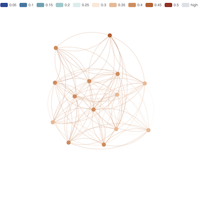
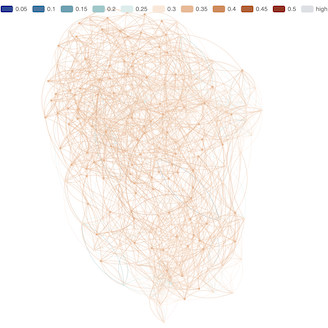
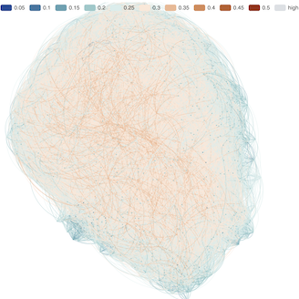
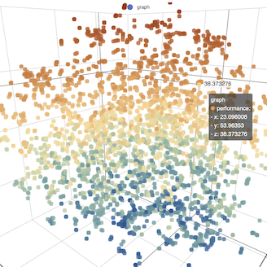

<p align="center">
  
  <h3 align="center">Hierarchical Navigable Small World Graphs</h3>
  <p align="center"><strong>in-memory data structure for approximate nearest neighbor search in high-dimensional spaces</strong></p>

  <p align="center">
    <!-- Version -->
    <a href="https://github.com/fogfish/hnsw/releases">
      
    </a>
    <!-- Documentation -->
    <a href="https://pkg.go.dev/github.com/fogfish/hnsw">
      
    </a>
    <!-- Build Status -->
    <a href="https://github.com/fogfish/hnsw/actions/">
      
    </a>
    <!-- GitHub -->
    <a href="http://github.com/fogfish/hnsw">
      
    </a>
    <!-- Coverage -->
    <a href="https://coveralls.io/github/fogfish/hnsw?branch=main">
      
    </a>
    <!-- Go Card -->
    <a href="https://goreportcard.com/report/github.com/fogfish/hnsw">
      
    </a>
  </p>
</p>

--- 

The HNSW algorithm is an efficient and scalable method for approximate nearest neighbor search in high-dimensional spaces. This Golang library provides a generic implementation of the HNSW algorithm, allowing users to build, search, and manage HNSW graphs for their data. See the original publication: [Efficient and robust approximate nearest neighbor search using Hierarchical Navigable Small World graphs](https://arxiv.org/pdf/1603.09320.pdf).

## Features

- Fast and scalable nearest neighbor search.
- Efficient indexing and querying of high-dimensional data.
- Thread-safe and concurrent I/O.
- Customizable parameters for tuning performance.
- Easy-to-use API for building and querying HNSW graphs.
- Generics for building and querying domain objects.
- Command-line utility for index analysis. 


## Getting Started

- [Features](#features)
- [Getting Started](#getting-started)
  - [Quick example](#quick-example)
  - [Key abstraction](#key-abstraction)
  - [Creating an Index](#creating-an-index)
  - [Insert vectors](#insert-vectors)
  - [Batch insert](#batch-insert)
  - [Searching for Nearest Neighbors](#searching-for-nearest-neighbors)
  - [Breadth-first search](#breadth-first-search)
  - [Example](#example)
- [Command line utility](#command-line-utility)
  - [GLoVe](#glove)
  - [SIFT](#sift)
- [How To Contribute](#how-to-contribute)
  - [commit message](#commit-message)
  - [bugs](#bugs)
- [License](#license)
- [References](#references)


The latest version of the module is available at `main` branch. All development, including new features and bug fixes, take place on the `main` branch using forking and pull requests as described in contribution guidelines. The stable version is available via Golang modules.

Use `go get` to retrieve the library and add it as dependency to your application.

```bash
go get -u github.com/fogfish/hnsw
```

### Quick example

Here is [a simple example](./examples/basic/main.go) to get you started with this HNSW library:

```go
package main

import (
  "fmt"

  "github.com/fogfish/hnsw"
  "github.com/fogfish/hnsw/vector"
  surface "github.com/kshard/vector"
)

func main() {
  // Create new HNSW index
  index := hnsw.New(vector.SurfaceVF32(surface.Cosine()))

  // Add some data points to the index
  index.Insert(vector.VF32{Key: 1, Vec: []float32{0.1, 0.2, /* ... */ 0.128}})
  index.Insert(vector.VF32{Key: 2, Vec: []float32{0.4, 0.5, /* ... */ 0.128}})

  // Perform a nearest neighbor search
  query := vector.VF32{Vec: []float32{0.15, 0.25, /* ... */ 0.128}
  neighbors := index.Search(query, 10, 100)

  // Print the results
  fmt.Println("Nearest neighbors:", neighbors)
}
```

The full documentation is available on [GoDoc](https://godoc.org/github.com/fogfish/hnsw).


### Key abstraction

Data types definition is an essential part of development with the library. Golang structs declares domain of your application.

The HNSW data structure utilizes Golang generics, allowing library clients to define their own types. This design decision, while potentially complicating initial adoption, makes the structure highly versatile and usable in any context. The library assumes nothing about the type it stores; instead, the client is only required to define the distance function against own types as

```go
type Surface[Vector any] interface {
  Distance(Vector, Vector) float32
}
```

To assist with implementation, the library provides a reference implementation at `github.com/fogfish/hnsw/vector` for float32 vector traits annotated with unique IDs (see `vector.VF32` and `vector.KF32`). Additionally, the companion library [vector](https://github.com/kshard/vector) helps implement efficient vector algebra.

Here is [a example](./examples/attributes/main.go) to implement HNSW index for data type with custom attributes:

```go
import (
  "github.com/kshard/vector"
)

// Custom type
type Embedding struct {
  Vec  surface.F32
  Text string
  /* ... add more attributes ... */
}

// Declare surface distance function for Embedding.
var (
  surface = vector.ContraMap[vector.F32, Embedding]{
    Surface:   vector.Cosine(),
    ContraMap: func(e Embedding) vector.F32 { return e.Vec },
  }
)

// Create index for Embedding type
index := hnsw.New(surface)
```

### Creating an Index

To create a new HNSW index, you need to specify the configuration parameters such as the distance function and the construction parameter:

```go
hnsw.New(vector.SurfaceVF32(surface.Cosine()),
  // Construction Efficiency Factor (efConstruction)
  hnsw.WithEfConstruction(200),
  // Maximum number of connections per node (M)
  hnsw.WithM(16),
  // Maximum number of connections per node at level 0 (M0)
  hnsw.WithM0(32),
)
```

Optimization of given algorithm parameters is key to achieving the best performance for your specific use case. The primary parameters to focus on includes `M`, `M` and `efConstruction`. `M` and `M0` controls the maximum number of connections per node, balancing between memory usage and search efficiency. `efConstruction` determines the number of candidate nodes evaluated during graph construction, influencing both the construction time and the accuracy of the graph. Additionally, the `mL` parameter, or maximum level, dictates the hierarchical structure's depth, affecting both connectivity and search efficiency. You can optimize the balance between accuracy, speed, and resource usage, tailoring the HNSW algorithm to the demands of your dataset and application. The command line utility supports the hyper optimization process.

**Be aware** that managing disconnected nodes is crucial in Hierarchical Navigable Small World (HNSW) Graphs to maintain the algorithm's efficiency and robustness. Disconnected nodes can occur when connections are pruned during the insertion of new nodes, leading to isolated nodes that degrade the performance of nearest neighbor searches. To mitigate this issue tune `M0`. This approach minimizes the risk of disconnections, ensuring reliable and efficient graph traversal during search operations. 

### Insert vectors

To insert vector to the index, use the `Insert` method passing appropriate data type:

```go
index.Insert(vector.VF32{Key: 1, Vec: []float32{0.1, 0.2, /* ... */ 0.128}})
```

### Batch insert

The HNSW library supports batch insert operations, making it efficient to add large datasets. It leverages Golang channels to handle parallel writes, ensuring that multiple data points can be inserted concurrently. This design maximizes performance and minimizes the time required to build the HNSW graph, making the library suitable for handling high-throughput data insertion scenarios.

```go
// create channel for parallel writes
ch := index.Pipe(runtime.NumCPU())

// insert vector to the index
ch <- vector.VF32{Key: 1, Vec: []float32{0.1, 0.2, /* ... */ 0.128}}
```

### Searching for Nearest Neighbors

Searching for nearest neighbors in the HNSW library is performed using the `Search` function. This method requires a query vector parameter, which represents the point in the high-dimensional space for which you want to find the nearest neighbors. You have to wrap the vector to same data type as index support. The `efSearch` parameter controls the number of candidate nodes to evaluate during the search process, directly affecting the trade-off between search speed and accuracy. A higher `efSearch` value typically results in more accurate results at the expense of increased computation. The `k` parameter specifies the number of nearest neighbors to return. By tuning `efSearch` and `k`, you can balance performance and precision according to your specific needs.

```go
query := vector.VF32{Vec: []float32{0.15, 0.25, /* ... */ 0.128}}
neighbors := index.Search(query, 10, 100)
```

Use `Distance` function to fine-tune neighbors results, filtering non relevant values.

```go
for _, vector := range neighbors {
  if index.Distance(query, vector) < 0.2 {
    // do something
  }
}
```

### Breadth-first search

The HNSW library includes a breadth-first search functionality through the `ForAll` method. This method performs a full scan, iterating over all nodes linked at a specific level of the graph. It takes a visitor function as an argument, defined as `func(rank int, vector Vector, vertex []Vector) error`, where rank is the level of the node, vector is the node's vector, and vertex represents all outgoing edges. By performing a full scan, the `ForAll` method ensures comprehensive exploration of the graph's nodes, making it useful for applications that require a complete overview of the graph structure at a given level.

```go
// Scan all nodes at level 0
index.ForAll(0,
  func(rank int, vector Vector, vertex []Vector) error {
    //
    return nil
  },
)
```

### Example

The following visualization illustrates a Hierarchical Navigable Small World (HNSW) graph constructed from 4,000 vectors representing the top English words. This graph showcases the hierarchical structure and navigability of the small-world network built using these word vectors.

|                    |                                                        |
| ------------------ | ------------------------------------------------------ |
| HNSW Layer 2       |  |
| HNSW Layer 1       |  |
| HNSW Layer 0       |  |
| Vector point cloud |   |


## Command line utility

The HNSW library includes a command-line utility designed for hyper-optimizing the parameters of your HNSW graphs. This tool allows you to efficiently explore various configurations, such as `M`, `M0`, `efConstruction`, and others, to find the optimal settings for your specific dataset and use case.

You can install the utility from source code.

```bash
go install github.com/fogfish/hnsw/cmd/hnsw@latest
```

The command line utility is tailored for working with [GLoVe](https://nlp.stanford.edu/projects/glove/), [SIFT](http://corpus-texmex.irisa.fr) or your own dataset in the textual (GLoVe format).


### GLoVe

The command-line utility support the creation and optimization of HNSW indices, using GloVe-like datasets. You can `create` an HNSW index tailored to your dataset, evaluate the index quality by `query` the same indexed words, and `draw` the graph layers to gain insights into the structure and connectivity of your data. The dataset assumes usage of cosine distance between words.

Obtain GLoVe dataset copy for evaluation from https://nlp.stanford.edu/projects/glove/, or use any textual representation following the format:

```
word -0.37604 0.24116 ... -0.26098 -0.0079604
```

```bash
hnsw help glove 

hnsw glove create \
  -i path/to/hnsw/index \
  -g path/to/glove/dataset.txt \
  -e 200 -m 16 -0 32

hnsw glove query \
  -i path/to/hnsw/index \
  -g path/to/glove/dataset.txt

hnsw glove draw \
  -i path/to/hnsw/index \
  --html path/to/graph.html
  -l 2
```

### SIFT

The command-line utility support the creation and validation of HNSW indices, using SIFT datasets that provides vectors dataset together with ground truth matches. You can `create` an HNSW index tailored to your dataset, evaluate the index quality by `query` the ground truth data , and `draw` the graph layers to gain insights into the structure and connectivity of your data. The dataset assumes usage of euclidean distance between indexed vectors.

Obtain GLoVe dataset copy for evaluation from http://corpus-texmex.irisa.fr

```bash
hnsw help sift

hnsw sift create \
  -i path/to/hnsw/index \
  -g path/to/sift/dataset.txt \
  -e 200 -m 16 -0 32

hnsw sift query \
  -i path/to/hnsw/index \
  -g path/to/sift/dataset.txt

hnsw sift draw \
  -i path/to/hnsw/index \
  --html path/to/graph.html
  -l 2
```

## How To Contribute

The library is [MIT](LICENSE) licensed and accepts contributions via GitHub pull requests:

1. Fork it
2. Create your feature branch (`git checkout -b my-new-feature`)
3. Commit your changes (`git commit -am 'Added some feature'`)
4. Push to the branch (`git push origin my-new-feature`)
5. Create new Pull Request

The build and testing process requires [Go](https://golang.org) version 1.21 or later.


### commit message

The commit message helps us to write a good release note, speed-up review process. The message should address two question what changed and why. The project follows the template defined by chapter [Contributing to a Project](http://git-scm.com/book/ch5-2.html) of Git book.

### bugs

If you experience any issues with the library, please let us know via [GitHub issues](https://github.com/fogfish/hnsw/issue). We appreciate detailed and accurate reports that help us to identity and replicate the issue. 


## License

[](LICENSE)


## References

1. [Efficient and robust approximate nearest neighbor search using Hierarchical Navigable Small World graphs](https://arxiv.org/pdf/1603.09320)
2. [GloVe: Global Vectors for Word Representation](https://nlp.stanford.edu/projects/glove/)
3. [Datasets for approximate nearest neighbor search](http://corpus-texmex.irisa.fr)
4. [t-SNE: t-distributed stochastic neighbor embedding](https://en.wikipedia.org/wiki/T-distributed_stochastic_neighbor_embedding)
5. [How to Use t-SNE Effectively](https://distill.pub/2016/misread-tsne/)
6. https://github.com/danaugrs/go-tsne
7. https://github.com/dwyl/english-words
8. https://echarts.apache.org/examples/en/index.html#chart-type-graph
